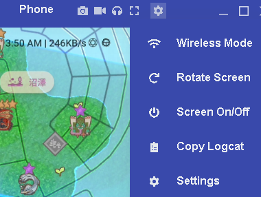
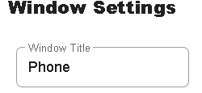

# Only Work For PC
https://youtu.be/UMaefCH2-Uw 

Using Vmos to spoof  
Use Long Sword to 1 shot mob, dont use charge weapon
## How to spoof using vmos
https://rb.gy/r0nw4
  Disclaimer : take your own risk for spoofing

## How to use PC to play
1. Download Vysor https://www.vysor.io/
2. Connect your phone to pc with usb
3. Open Developer mode and able usb debugger
4.  Then you should able access your phone through pc mouse
5.  Zoom out until only monster icon were show
6.  Then run the code

## Not using Vysor
1. Other application allow access your phone with pc is fine as well
2. Just make sure to adjust the screen by changing the app name to Phone
3. Or change the code using pycharm accroding this instruction
4. Open utils.py using pycharm ide
5. press Crtl + f and type phone
6. change the "phone" to your application name
7. then run  main.py (dont run exe since the changing name of phone dont apply on exe）
8. you could update the exe by open the terminal with hotkey alt + F12 (delete the exe first)
9. copy the code bellow on terminal
10. pyinstaller --onefile main.py -w
11. a new exe will generate inside dist foler
12. move the exe out on the same level as main.py
13. now exe is updated

## What it Does
* Slay the small mobs surrounding you.

## How To Download and run the code
1. Go to Upper right <>Code
2. Download Zip
3. Extract the zipped folder at anywhere
4. Execute the main.exe (some update may not reflect on exe)
5. Or Run main.py using pycharm (Recommended) 

## Setup
* Set the window name to Phone
---

---

---
 

# How To Use
* Adjust The Screen
* Set your phone's graphics to the lowest settings if you have a potato phone
* Make sure to use Long Sword
* Clicking the x on top right corner to terminate the program
